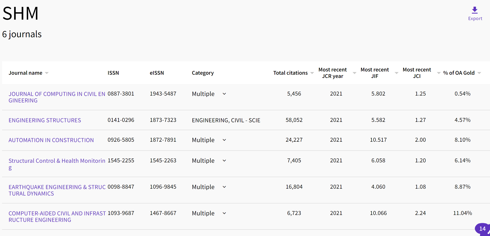
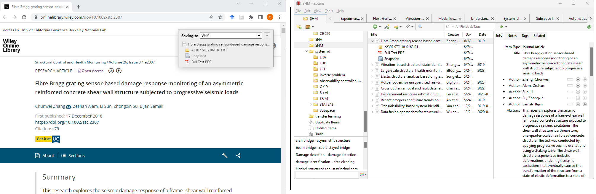

# Literature Review Guide

## Learning about a particular topic
- Google Scholar or Web of Science, colleagues, review paper references, conference paper references
- Citations and authors
- Follow references until landing on a paper that boils down methodology and experimental results in a helpful and relevant way.
- https://www.litmaps.com/ and https://www.citationgecko.com/ can refer you to related papers.

## Staying up-to-date on recent publications
- Look through the most recent issues of relevant journals [(Example: SHM journals)](#example-shm-journal-list)
- Look at feature papers with more citations
- [Journal Citation Reports](https://jcr.clarivate.com/jcr/home) provide rankings and statistics on any journal indexed in Web of Science.[*](https://researchguides.uic.edu/if/impact) You can:
    - Save journals into a favorites list
    - Compare journals side-by-side
    - View the most citable items in the past two years
    - View trends on citability of the journal

## Example: SHM Journal List
| Abbreviation | ISSN | Journal Name | 2021 [Impact Factor](#impact-factor) |
|--------------|------|--------------|--------------------------------------|
| Earthq. Eng. Struct. Dyn. | 0098-8847 | Earthquake Engineering and Structural Dynamics | 4.060 |
| CACIE            | 1093-9687 | Computer-Aided Civil and Infrastructure Engineering | 10.066 |
| Autom. Constr.   | 0926-5805 | Automation in Construction                          | 10.517 |
| Eng. Struct.     | 0141-0296 | Engineering Structures                              | 5.582  |
| Struct. Control. Health Monit. | 1545-2255 | Structural Control and Health Monitoring | 6.058 |
| J. Comput. Civil. Eng. | 0887-3801 | Journal of computing in civil engineering           | 5.802 |

## Organizing Papers
Zotero and Mendeley have useful apps for organizing your literature reviews. You can:
- Automatically link to Overleaf for bibliographies
- Download a paper and all its metadata from your internet browser
- Annotate and organize papers in collections

## Impact Factor
Impact factor gives a rough idea of how citable a journal is. There are many limitations to impact factor and there are several other ways to measure a journal's usefulness, such as SJR (SCImago Journal Rank) and SNIP (Source Normalized Impact per Paper), but I personally haven't looked into those metrics.
